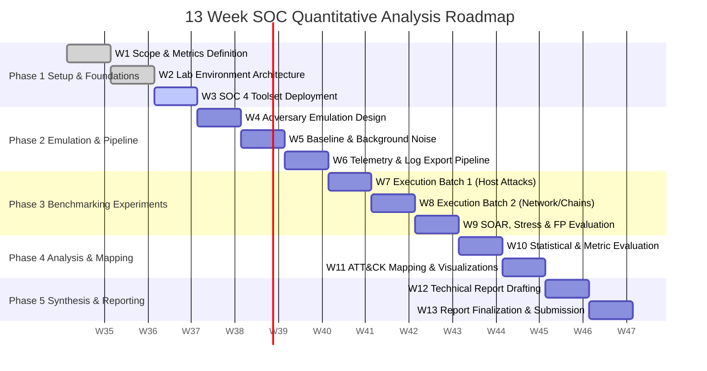

# Quantitative Analysis of SOC Toolsets (5 ECTS)
**Danish Title:** Kvantitativ analyse af SOC værktøjer  
**Course Type:** Special Course (*Specialkursus*)
**Workload:** 5 ECTS (~135 total hours / ~10 to 11 hours per week across 13 weeks)

---

## 📌 Course Overview & Objectives

Security Operations Centers (SOCs) operate in complex environments utilizing SIEM, EDR/XDR, SOAR, and IDS/IPS toolsets. This special course focuses on an empirical, quantitative evaluation of four selected open source SOC toolsets across the detection, triage, and automated response lifecycle rather than relying on qualitative vendor claims.

Through a combination of isolated virtual lab deployment, controlled adversary emulation mapped to the MITRE ATT&CK framework, and rigorous statistical data analysis in Python, this course benchmarks detection efficacy, operational overhead, coverage gaps, and temporal performance metrics (MTTD/MTTR).

### Key Learning Objectives
- **Architecture & Ecosystem:** Understand the purpose and mechanics of core SOC toolset categories across endpoint detection, network analysis, case management, and SOAR automation.
- **Quantitative Metrics:** Define and compute True/False Positive Rates (TPR/FPR), Precision, Recall, F1 Score, Mean Time to Detect (MTTD), Mean Time to Respond (MTTR), and alert volume overhead.
- **Experimental Design:** Design a controlled, reproducible adversary emulation experiment mapped to MITRE ATT&CK techniques.
- **Lab & Data Pipeline:** Deploy open source tooling, capture raw event/alert telemetry, synchronize timestamps, and clean log streams.
- **Statistical & Coverage Analysis:** Analyze detection data using Python (`pandas`, `scipy`, `statsmodels`, `scikit learn`), map coverage with MITRE ATT&CK Navigator.
- **Academic Reporting:** Document the methodology, empirical results, statistical tests, and architectural recommendations in a formal technical report.

---

## 🛠️ Tooling & Architecture Stack

Four functional SOC toolsets were selected to evaluate the complete detection, investigation, and automated response pipeline without redundant standalone log indexing layers:

| Category | Selected Toolset | Role in Quantitative Evaluation |
| :--- | :--- | :--- |
| **SIEM / Host EDR / XDR** | **Wazuh** | Host level telemetry, log analysis, file integrity monitoring (FIM), and threat detection. |
| **Network IDS / IPS** | **Suricata** | Signature based and protocol anomaly network traffic inspection. |
| **Case Management & Triage** | **TheHive + Cortex** | Security incident response, alert aggregation, observable analysis, and triage time tracking. |
| **SOAR & Workflow Automation** | **Shuffle** | Open source automation engine for alert enrichment, routing, and measuring MTTR. |
| **Adversary Emulation** | **Atomic Red Team** / **MITRE Caldera** | Generating ground truth attack telemetry mapped to MITRE ATT&CK techniques. |
| **Coverage Visualization** | **MITRE ATT&CK Navigator** | Visualizing layer by layer technique detection coverage and blind spots. |
| **Data Analysis & Statistics** | **Python 3.x** (`pandas`, `scipy`, `statsmodels`, `scikit learn`, `matplotlib`, `seaborn`) | Calculating confusion matrices, ROC/PR curves, hypothesis testing, and MTTD/MTTR distributions. |
| **Lab Infrastructure** | **Docker & Docker Compose**, **VirtualBox / VMware** | Host isolated target victim endpoints, attacker node, and containerized SOC cluster. |

---

## 📅 13 Week Semester Schedule

---

### Phase 1: Scope & Lab Architecture (Weeks 1 to 3)

#### Week 1: Literature Review, Scope Finalization & Metric Formalization
* Weekly Focus: Define research questions, confirm the 4 selected toolsets (Wazuh, Suricata, TheHive+Cortex, Shuffle), and formalize mathematical metric formulas.
* Tasks:
  - [ ] Review literature on SOC benchmarking, alert fatigue, and detection engineering evaluations.
  - [ ] Finalize the 4 toolsets under study across host detection, network detection, case management, and SOAR automation.
  - [ ] Formulate experimental hypotheses (e.g., detection latency vs. noise trade offs, rule sensitivity vs. false discovery rate, automated response MTTR reduction).
  - [ ] Mathematically formalize evaluation metrics:
    - $\text{TPR} / \text{Recall} = \frac{TP}{TP + FN}$
    - $\text{FPR} = \frac{FP}{FP + TN}$
    - $\text{Precision} = \frac{TP}{TP + FP}$
    - $F_1\text{ Score} = 2 \cdot \frac{\text{Precision} \cdot \text{Recall}}{\text{Precision} + \text{Recall}}$
    - $\text{MTTD} = \frac{1}{N}\sum_{i=1}^N (t_{\text{alert}, i} - t_{\text{execution}, i})$
    - $\text{MTTR} = \frac{1}{N}\sum_{i=1}^N (t_{\text{resolved}, i} - t_{\text{alert}, i})$
  - [ ] Align with academic supervisor on scope, tool selection rationale, and deliverables.
* Deliverable: Initial Project Scope document and Metric Definition Sheet.

---

#### Week 2: Lab Infrastructure & Virtual Network Setup
* Weekly Focus: Build the isolated virtualized testbed and networking infrastructure.
* Tasks:
  - [ ] Design isolated multi subnet virtual lab topology (Attacker Subnet, Target Subnet, SOC Management Subnet).
  - [ ] Set up virtualization host or container environment with Docker Compose.
  - [ ] Provision target victim machines (e.g., Ubuntu Linux Server/Desktop, Windows Server/10 target).
  - [ ] Provision attacker machine (Kali Linux / Ubuntu with execution harnesses).
  - [ ] Configure strict network isolation, internal DNS, and NTP synchronization across all VMs for sub second timestamp accuracy.
* Deliverable: Operational multi node virtual lab environment with verified host to host connectivity and synchronized clocks.

---

#### Week 3: SOC Toolset Deployment & Baseline Configuration
* Weekly Focus: Deploy, configure, and verify the 4 selected SOC toolsets under evaluation.
* Tasks:
  - [ ] Deploy Wazuh manager, indexer, and dashboard; install Wazuh agents on all target endpoints.
  - [ ] Deploy Suricata on the network gateway/mirror interface with standard rulesets.
  - [ ] Deploy TheHive and Cortex instances for case management and observable analyzers.
  - [ ] Deploy Shuffle SOAR and configure webhook integrations with Wazuh and TheHive.
  - [ ] Verify agent telemetry heartbeat, log ingestion, alert routing, and baseline dashboard visibility.
  - [ ] Document configuration baselines, active rule counts, and idle resource utilization (CPU/RAM).
* Deliverable: Fully operational SOC monitoring and response environment collecting telemetry and generating baseline health logs.

---

### Phase 2: Adversary Emulation, Baselining & Pipeline Design (Weeks 4 to 6)

#### Week 4: Adversary Emulation Framework & MITRE ATT&CK Test Plan
* Weekly Focus: Curate the test corpus of simulated attack techniques mapped to MITRE ATT&CK.
* Tasks:
  - [ ] Install and configure Atomic Red Team (Invoke AtomicRedTeam) and/or MITRE Caldera on the test harness.
  - [ ] Select a balanced corpus of MITRE ATT&CK techniques covering major tactics:
    - Discovery (e.g., T1082 System Information Discovery, T1087 Account Discovery)
    - Execution (e.g., T1059 Command and Scripting Interpreter)
    - Persistence (e.g., T1053 Scheduled Task/Cron, T1547 Boot or Logon Autostart)
    - Privilege Escalation (e.g., T1548 Abuse Elevation Control Mechanism)
    - Defense Evasion (e.g., T1070 Indicator Removal on Host, T1036 Masquerading)
    - Credential Access (e.g., T1003 OS Credential Dumping)
    - Lateral Movement / C2 (e.g., T1021 Remote Services, T1071 Application Layer Protocol)
  - [ ] Build execution scripts with ground truth metadata (Technique ID, Execution Timestamp $t_0$, Test ID, Expected Artifacts).
* Deliverable: MITRE ATT&CK Test Matrix catalogue with reproducible execution scripts and ground truth schemas.

---

#### Week 5: Normal Background Activity Baselining & Noise Generation
* Weekly Focus: Model normal user and background traffic to enable false positive and precision evaluation.
* Tasks:
  - [ ] Script benign background host activity (cron tasks, package updates, routine user navigation, administrative SSH commands).
  - [ ] Script benign network traffic (HTTP/HTTPS web browsing, DNS queries, file transfers).
  - [ ] Run benign activity sessions across target machines to establish realistic background log noise.
  - [ ] Quantify raw event volumes generated per hour/day by normal operations.
  - [ ] Identify any initial false positive alerts triggered on pristine/benign systems.
* Deliverable: Automated traffic generator scripts and baseline false positive profile.

---

#### Week 6: Data Extraction Pipeline & Automated Experiment Harness
* Weekly Focus: Automate the execution, log harvesting, time alignment, and data structuring pipeline.
* Tasks:
  - [ ] Write Python scripts to query toolset REST APIs (Wazuh API, Suricata eve.json, TheHive API, Shuffle execution logs).
  - [ ] Standardize exported alert logs into structured DataFrames (Fields: timestamp, toolset, technique_id, rule_id, rule_description, severity, raw_payload).
  - [ ] Build an automated test harness that:
    1. Records execution start timestamp ($t_{\text{start}}$).
    2. Runs an atomic attack or baseline test.
    3. Records execution completion timestamp ($t_{\text{end}}$).
    4. Waits for log ingestion and SOAR execution buffer period.
    5. Queries each SOC toolset API for matching alerts and incident creation.
    6. Tags outcome as True Positive (TP), False Positive (FP), or False Negative (FN).
* Deliverable: End to end Python pipeline capable of triggering attacks and harvesting labeled detection and response results.

---

### Phase 3: Controlled Benchmarking Experiments (Weeks 7 to 9)

#### Week 7: Host Based & Endpoint Detection
* Weekly Focus: Execute host based adversary tests and collect endpoint detection metrics from Wazuh.
* Tasks:
  - [ ] Execute the full suite of host based Atomic Red Team tests across target systems.
  - [ ] Benchmark default vs. tuned rule configurations independently against the same attack suite.
  - [ ] Collect raw alert data, log latency timestamps, and detection rule mappings.
  - [ ] Verify test repeatability by running 3 repeated trials per test case.
  - [ ] Log failed executions, partial detections, and unhandled telemetry events.
* Deliverable: Raw experimental dataset for host based attacks across endpoint toolsets.

---

#### Week 8: Network Attacks & Multi Stage Chains
* Weekly Focus: Execute network level adversary tests and multi stage attack scenarios.
* Tasks:
  - [ ] Execute network centric attack tests (port scans, command and control beacons, reverse shells, cleartext credential exfiltration).
  - [ ] Run simulated multi stage Caldera operations (initial access -> discovery -> privilege escalation -> exfiltration).
  - [ ] Evaluate how network IDS (Suricata) vs. host EDR (Wazuh) correlate and alert on combined attack chains.
  - [ ] Record alert aggregation behavior, correlation capability, and alert flooding characteristics.
* Deliverable: Raw experimental dataset for network attacks and multi stage emulation chains.

---

#### Week 9: SOAR Response, Stress Testing & Operational Trade Offs
* Weekly Focus: Evaluate false positive rates under heavy noise, measure Shuffle/TheHive automated response times (MTTR), and track resource consumption.
* Tasks:
  - [ ] Execute attack simulations concurrently with high volume benign background noise.
  - [ ] Measure impact of noise on False Positive Rate (FPR) and precision degradation.
  - [ ] Measure SOAR automated response metrics (MTTR, alert enrichment latency in Shuffle, case creation latency in TheHive).
  - [ ] Monitor and log host resource consumption on agents and servers (CPU %, Memory footprint, Disk I/O, Network bandwidth).
  - [ ] Perform data validation checks on all collected experimental trial datasets.
* Deliverable: Complete, cleaned experimental dataset including attack, noise, SOAR response, and resource consumption telemetry.

---

### Phase 4: Statistical Analysis, Coverage Mapping & Visualization (Weeks 10 to 11)

#### Week 10: Statistical Data Analysis & Quantitative Metrics Evaluation
* Weekly Focus: Analyze experimental data using Python data science libraries and hypothesis testing.
* Tasks:
  - [ ] Calculate comprehensive detection and response metrics per toolset/configuration:
    - Confusion matrices (TP, FP, FN, TN)
    - Precision, Recall (Sensitivity), Specificity, and F1 Score
    - Mean Time to Detect (MTTD) and Mean Time to Respond (MTTR): mean, median, standard deviation, and 95th percentile
  - [ ] Perform statistical hypothesis tests (e.g., Mann Whitney U or Wilcoxon signed rank tests for latency differences; Chi squared / McNemar's tests for detection rate differences).
  - [ ] Analyze correlation between rule complexity and false positive generation.
  - [ ] Organize data into reproducible Jupyter Notebooks (analysis.ipynb).
* Deliverable: Jupyter Notebooks containing complete statistical analysis, metric summary tables, and statistical significance test results.

---

#### Week 11: MITRE ATT&CK Coverage Mapping & Visual Artifact Generation
* Weekly Focus: Construct visual coverage layers and publication ready comparative plots.
* Tasks:
  - [ ] Generate MITRE ATT&CK Navigator JSON layers showing:
    - Host detection coverage (Wazuh)
    - Network detection coverage (Suricata)
    - Combined coverage and unique blind spots.
  - [ ] Generate high resolution figures in Python:
    - Bar charts of Precision/Recall/F1 across attack tactics.
    - MTTD and MTTR distribution boxplots and violin plots.
    - Resource consumption comparisons (CPU/RAM overhead vs. detection efficacy).
    - ROC curves / Precision Recall trade off curves where applicable.
* Deliverable: ATT&CK Navigator visualization files and publication quality charts for the final report.

---

### Phase 5: Synthesis, Technical Report & Submission (Weeks 12 to 13)

#### Week 12: Technical Report Drafting
* Weekly Focus: Draft the core content of the academic technical report.
* Tasks:
  - [ ] Draft Introduction & Motivation: Problem statement, SOC challenge, importance of quantitative evaluation.
  - [ ] Draft Related Work & Background: Architectural review of SIEM/EDR, NIDS, Case Management, SOAR, and MITRE ATT&CK taxonomy.
  - [ ] Draft Methodology & Experimental Setup: Lab topology, toolset configurations (Wazuh, Suricata, TheHive, Shuffle), attack selection rationale, traffic modeling, metric formulas.
  - [ ] Draft Results & Statistical Findings: Quantitative metrics tables, hypothesis test outcomes, latency distributions (MTTD/MTTR), ATT&CK coverage findings.
  - [ ] Draft Discussion & Operational Trade Offs: Efficacy vs. noise, automated response benefits, resource costs, configuration tuning recommendations, threats to validity.
* Deliverable: Complete initial draft of the technical report.

---

#### Week 13: Review, Reproducibility Packaging & Final Submission
* Weekly Focus: Polish report text, package code/lab artifacts for reproducibility, and submit.
* Tasks:
  - [ ] Review report against all formal Course Learning Objectives and grading criteria.
  - [ ] Clean and document the GitHub code repository:
    - Add clear README instructions for reproducing the lab.
    - Clean Python scripts and Jupyter notebooks with documentation.
    - Export Docker Compose files, configuration files, and raw sanitized data.
  - [ ] Proofread, format citations, and generate final PDF technical report.
  - [ ] Submit report and code repository.
* Deliverable: Final submitted Technical Report (PDF) and clean reproducible Project Repository.
