# Week 2: Lab Infrastructure & Virtual Network Setup

**Phase:** 1 — Scope & Lab Architecture  
**Period:** Week 2 (2026-09-07 → 2026-09-13)  
**Deliverable:** Operational multi-node virtual lab environment with verified host-to-host connectivity and synchronized clocks.

---

## Task Checklist

- [x] Define and create isolated multi-subnet virtual lab topology (Target Subnet, Attacker Subnet, SOC Management Network).
- [x] Register and start libvirt virtual networks (`soc-target-net` virbr1, `soc-attacker-net` virbr2).
- [x] Provision Ubuntu 24.04 target victim VM (1.5 GB RAM, 20 GB disk, static IP 10.0.1.10).
- [x] Provision Kali Linux attacker VM (1.5 GB RAM, 20 GB disk, static IP 10.0.2.10).
- [x] Enable host IP forwarding so attacker VM can route to target subnet.
- [x] Verify VM-to-VM connectivity across subnets (attacker → target ping).
- [x] Configure `chrony` NTP on all VMs synced to host for sub-second timestamp accuracy.
- [x] Validate Docker Compose file syntax and pull all SOC cluster images (do not start services yet).
- [x] Create placeholder directory structure for Suricata logs and rules.
- [x] Document final lab topology diagram, IP assignments, and port reference table.

---

## 1. Lab Architecture Overview

### 1.1 Design Philosophy

The lab uses a **Hybrid Architecture**: SOC tooling runs as Docker containers on the host, while target and attacker nodes are QEMU/KVM virtual machines. This approach provides:

- **Reproducibility:** The entire SOC cluster is defined in a single `docker-compose.yml`. One command recreates the environment from scratch.
- **Realism:** Wazuh agents run inside proper VM operating systems with real kernel syscall surfaces
- **Network authenticity:** Suricata captures real inter VM IP traffic as it crosses the host routing table, giving genuine network layer detections rather than container bridge loopback artifacts.

### 1.2 Network Topology Diagram (Will be used for rest of the weeks as well)

```
┌─────────────────────────────────────────────────────────────────────────────┐
│  HOST MACHINE — Fedora Linux, i5-11400H, 16 GB RAM                          │
│                                                                             │
│  ┌─────────────────────────────────────────────────────────────────────┐    │
│  │  Docker Bridge: soc-net (172.20.0.0/24)                             │    │
│  │                                                                     │    │
│  │  172.20.0.10  wazuh-indexer      (OpenSearch, port 9200)            │    │
│  │  172.20.0.11  wazuh-manager      (OSSEC manager, ports 1514/55000)  │    │
│  │  172.20.0.12  wazuh-dashboard    (UI, port 5601)                    │    │
│  │  172.20.0.20  cassandra          (TheHive DB, internal)             │    │
│  │  172.20.0.21  minio              (TheHive storage, ports 9000/9001) │    │
│  │  172.20.0.22  thehive            (Case mgmt UI, port 9090)          │    │
│  │  172.20.0.23  cortex             (Analyzer engine, port 9091)       │    │
│  │  172.20.0.30  shuffle-frontend   (SOAR UI, port 3001)               │    │
│  │  172.20.0.31  shuffle-backend    (SOAR API, port 5001)              │    │
│  │  172.20.0.32  shuffle-opensearch (SOAR DB, internal)                │    │
│  └─────────────────────────────────────────────────────────────────────┘    │
│                                                                             │
│  ┌──────────────────────────────┐   ┌──────────────────────────────────┐    │
│  │  virbr1 — Target Subnet      │   │  virbr2 — Attacker Subnet        │    │
│  │  10.0.1.0/24                 │   │  10.0.2.0/24                     │    │
│  │                              │   │                                  │    │
│  │  10.0.1.1   Host gateway     │   │  10.0.2.1   Host gateway         │    │
│  │  10.0.1.10  Ubuntu 24.04 VM  │   │  10.0.2.10  Kali Linux VM        │    │
│  │             (victim target)  │   │             (attacker)           │    │
│  └──────────────────────────────┘   └──────────────────────────────────┘    │
│                   ▲                                                         │
│                   │ Suricata (host-network mode) sniffs virbr1              │
│                   │ capturing all attacker→target traffic                   │
│                                                                             │
│  IP Forwarding: enabled (attacker VM routes to target subnet via host)      │
│  NTP: chrony on all VMs synced to host (pool.ntp.org fallback)              │
└─────────────────────────────────────────────────────────────────────────────┘
```

### 1.3 Resource Budget

| Component | RAM Alloc | vCPUs | Disk |
|-----------|-----------|-------|------|
| Wazuh Indexer (Docker) | 1 GB (`-Xms1g -Xmx1g`) | — | 10 GB vol |
| Wazuh Manager (Docker) | ~512 MB | — | 5 GB vol |
| Wazuh Dashboard (Docker) | ~512 MB | — | 1 GB vol |
| Cassandra (Docker) | 640 MB | — | 10 GB vol |
| MinIO (Docker) | ~256 MB | — | 5 GB vol |
| TheHive (Docker) | 1 GB (`-Xms512m -Xmx1g`) | — | 5 GB vol |
| Cortex (Docker) | 512 MB (`-Xms256m -Xmx512m`) | — | 2 GB vol |
| Shuffle Backend (Docker) | ~512 MB | — | 2 GB vol |
| Shuffle OpenSearch (Docker) | 512 MB | — | 5 GB vol |
| Suricata (Docker, host-net) | ~256 MB | — | 2 GB logs |
| **SOC Docker total** | **~5.7 GB** | | |
| Ubuntu 24.04 target VM | 1.5 GB | 2 | 20 GB |
| Kali Linux attacker VM | 1.5 GB | 4 | 20 GB |
| **VM total** | **3.0 GB** | 6 | |
| Host OS + headroom | ~1.5 GB | | |
| **Grand Total** | **~10.2 GB** | | |

---

## 2. Steps taken to build the lab

### Step 1: Register libvirt Virtual Networks

The two VM bridge networks must be defined in libvirt before creating VMs.

```bash
# Define the networks from the XML files in the repo
sudo virsh net-define  lab/vm-networks/target-net.xml
sudo virsh net-define  lab/vm-networks/attacker-net.xml

# Start both networks
sudo virsh net-start   soc-target-net
sudo virsh net-start   soc-attacker-net

# Enable autostart on host reboot
sudo virsh net-autostart soc-target-net
sudo virsh net-autostart soc-attacker-net

# Verify — both should appear as 'active'
sudo virsh net-list --all
```

All three networks active with autostart enabled:

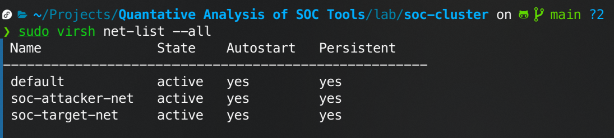

After this, verify the bridge interfaces exist on the host:

```bash
ip addr show virbr1   
ip addr show virbr2   
```

Both bridges UP with correct gateway IPs:

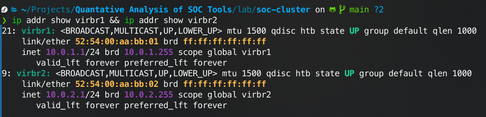

---

### Step 2: Enable Host IP Forwarding

Required so the attacker VM (10.0.2.x) can route to the target subnet (10.0.1.x) through the host.

```bash
sudo sysctl -w net.ipv4.ip_forward=1

# inter-bridge forwarding rules into libvirt's own nftables table.
# Fedora's libvirt uses 'ip libvirt_network'
sudo nft add rule ip libvirt_network forward iifname "virbr2" oifname "virbr1" accept
sudo nft add rule ip libvirt_network forward iifname "virbr1" oifname "virbr2" accept

sudo nft list table ip libvirt_network | grep virbr
```

IP forwarding enabled (`1`):

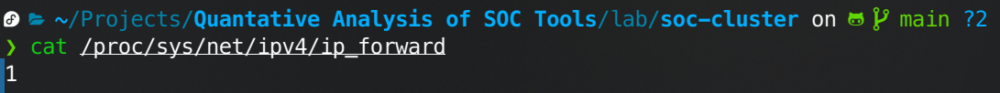

NAT `guest_output` chain showing `accept` before `reject` for both virbr1 and virbr2:

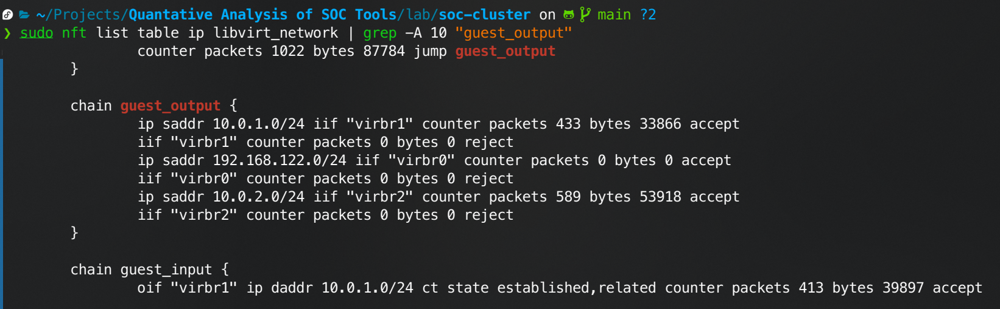


---

### Step 3: Provision Ubuntu 24.04 Target VM

```bash
# Create VM image directory
mkdir -p lab/vms/isos lab/vms/disks

# Download Ubuntu 24.04 LTS Server ISO (~1.5 GB)
wget -O lab/vms/isos/ubuntu-24.04-server.iso \
  https://releases.ubuntu.com/24.04.5/ubuntu-24.04.5-live-server-amd64.iso

# Create and start the VM
sudo virt-install \
  --name ubuntu-target \
  --ram 1536 \
  --vcpus 2 \
  --disk path=/var/lib/libvirt/images/ubuntu-target.qcow2,size=20,format=qcow2 \
  --network network=soc-target-net,mac=52:54:00:10:01:10 \
  --cdrom lab/vms/isos/ubuntu-24.04-server.iso \
  --os-variant ubuntu24.04 \
  --graphics vnc,listen=127.0.0.1 \
  --noautoconsole \
  --boot cdrom,hd
```

After installing I managed the vm in `virt-manager` for better gui control.

**Post-install inside the Ubuntu VM:**

```bash
# Confirm IP
ip addr show

# Update and install prerequisites
sudo apt update && sudo apt upgrade -y
sudo apt install -y curl wget git python3 python3-pip auditd audispd-plugins net-tools nmap tcpdump htop chrony

# Enable auditd (required for Wazuh auditd rule detections)
sudo systemctl enable --now auditd

# Enable chrony NTP (configured in Step 5)
sudo systemctl enable --now chrony
```

Ubuntu target VM confirmed at `10.0.1.10/24` via DHCP static lease:

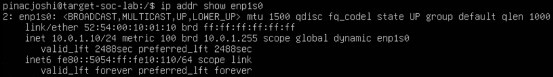

Default route via `10.0.1.1` (host gateway):

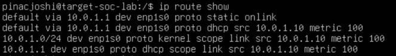

---

### Step 4: Provision Kali Linux Attacker VM

```bash
wget -O lab/vms/isos/kali-linux-2024.qemu.7z \
  https://cdimage.kali.org/kali-2024.4/kali-linux-2024.4-qemu-amd64.7z

# Extract filess
7za x lab/vms/isos/kali-linux-2024.qemu.7z -o lab/vms/isos/

# Import the prebuilt disk image
sudo virt-install \                   
  --name kali-attacker \
  --ram 1536 \
  --vcpus 2 \
  --disk path=lab/vms/isos/kali-linux-2024.4-qemu-amd64.qcow2,format=qcow2 \
  --network network=soc-attacker-net,mac=52:54:00:10:02:10 \
  --os-variant unknown \     
  --graphics vnc,listen=127.0.0.1 \
  --noautoconsole \
  --import
```

**Post-import inside Kali VM:**

```bash
# Confirm IP
ip addr show

sudo apt update && sudo apt upgrade -y

# Install prerequisites
sudo apt install -y powershell git python3 python3-pip ruby curl nmap chrony

# Enable chrony NTP and autostart
sudo systemctl enable --now chrony

# Verify route to target subnet
ping -c 3 10.0.1.10
```

Kali attacker VM confirmed at `10.0.2.10/24`:

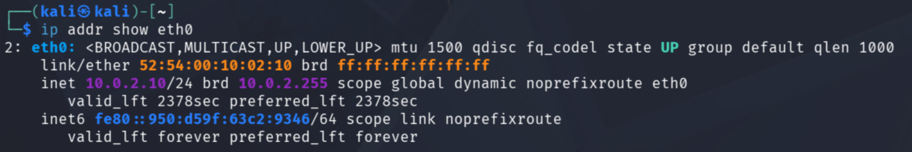

---

### Step 5: NTP Synchronization

> [!IMPORTANT]
> MTTD measurement requires that $t_{\text{execution}}$ (from the attacker harness) and $t_{\text{alert}}$ (from Wazuh/Suricata logs) share the same clock reference. Clock drift of even 1–2 seconds will corrupt latency measurements. All machines must sync to a common NTP source.

**On the Fedora host** — verify chrony is running:

```bash
chronyc tracking        # "System time" offset should be < 10 ms
chronyc sources -v      # Confirm NTP servers are reachable
```

**On Ubuntu target VM** — edit `/etc/chrony.conf`:

```
# Sync to host gateway first (lowest latency), fall back to pool
server 10.0.1.1 iburst prefer
pool pool.ntp.org iburst

makestep 1.0 3
rtcsync
```

```bash
sudo systemctl restart chrony
chronyc tracking
```

Ubuntu target VM chrony — system offset 0.41 ms (well within 100 ms threshold):

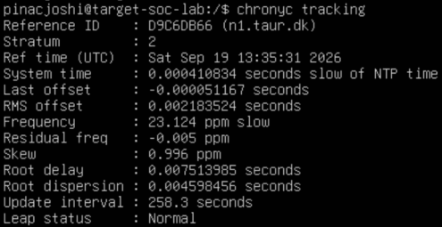

**On Kali attacker VM** — edit `/etc/chrony.conf`:

```
server 10.0.2.1 iburst prefer
pool pool.ntp.org iburst

makestep 1.0 3
rtcsync
```

```bash
sudo systemctl restart chrony
sudo systemctl enable chrony
chronyc tracking
```

Kali attacker VM chrony — system offset 0.16 ms:

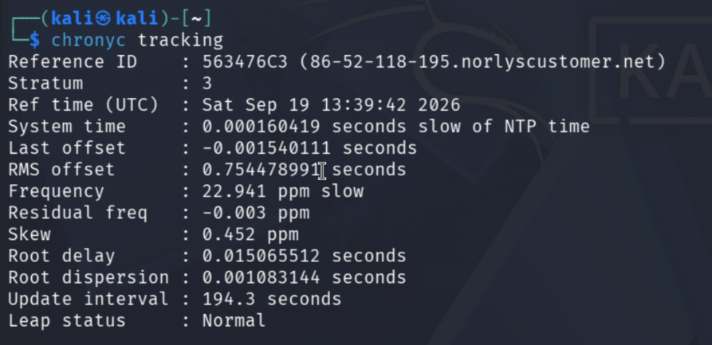

**Verification from host** — timestamps ascending in SSH execution order confirms all clocks are in sync:

```bash
echo "Host:   $(date +%s.%N)"
ssh -i ~/.ssh/soc-lab pinacjoshi@10.0.1.10 'echo "Target: $(date +%s.%N)"'
ssh -i ~/.ssh/soc-lab kali@10.0.2.10       'echo "Kali:   $(date +%s.%N)"'
```

All three timestamps ascending correctly (differences are SSH connection overhead, not clock drift):

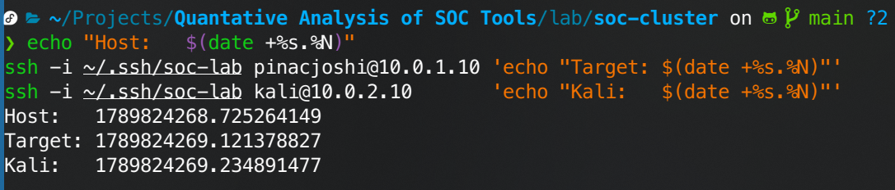

---

### Step 6: Validate Docker Compose & Pull Images


```bash
cd lab/soc-cluster

# Validate compose file syntax (no containers started)
docker compose config --quiet && echo "Syntax OK"

# Pull all images
docker compose pull
```

Docker Compose syntax validation passed:

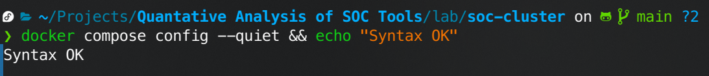

All 11 SOC cluster images pulled successfully:

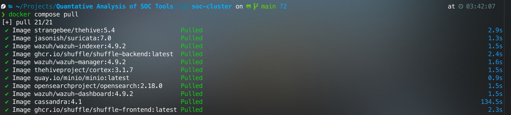

**Pulled images with actual disk sizes:**

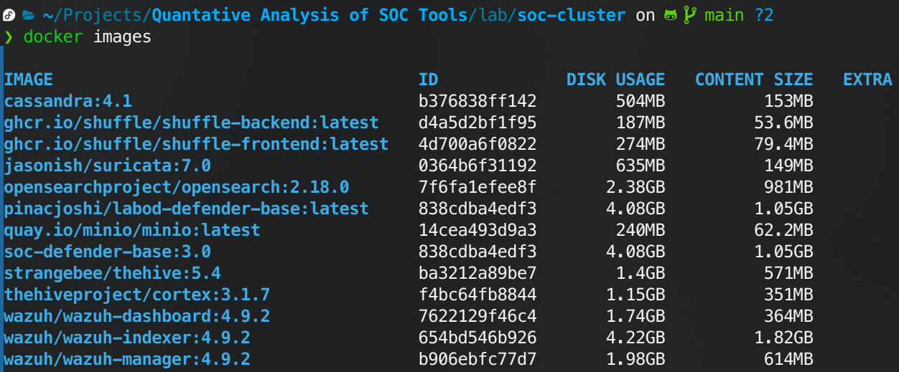

---

### Step 7: Create Suricata Log & Rules Directories

Suricata's bind mounts in the Compose file require these directories to exist on the host:

```bash
mkdir -p lab/soc-cluster/suricata/logs
mkdir -p lab/soc-cluster/suricata/rules

# Placeholder files so git tracks the directories
touch lab/soc-cluster/suricata/logs/.gitkeep
touch lab/soc-cluster/suricata/rules/.gitkeep
```

---

## 4. IP & Port Reference

### 4.1 VM Assignments

| Host | Role | IP | MAC | Network Bridge |
|------|------|----|-----|----------------|
| ubuntu-target | Target victim VM | 10.0.1.10 | 52:54:00:10:01:10 | virbr1 |
| kali-attacker | Attacker VM | 10.0.2.10 | 52:54:00:10:02:10 | virbr2 |
| Host virbr1 | Target subnet gateway | 10.0.1.1 | — | virbr1 |
| Host virbr2 | Attacker subnet gateway | 10.0.2.1 | — | virbr2 |

<!-- ### 4.2 SOC Cluster Service URLs

| Service | Host URL | Default Credentials |
|---------|----------|---------------------|
| Wazuh Dashboard | https://localhost:5601 | admin / SecureWazuh1! |
| Wazuh REST API | https://localhost:55000 | wazuh-wui / MyS3cr3tP4ssword |
| Wazuh Indexer | https://localhost:9200 | admin / SecureWazuh1! |
| TheHive | http://localhost:9090 | admin@thehive.local / secret |
| Cortex | http://localhost:9091 | Set on first run |
| Shuffle | http://localhost:3001 | Set on first run |
| MinIO Console | http://localhost:9001 | thehive / MinioP@ssw0rd! | -->
<!-- 
### 4.3 Agent Enrollment Ports

| Port | Protocol | Purpose | Allowed Sources |
|------|----------|---------|-----------------| 
| 1514 | TCP/UDP | Wazuh agent communication | 10.0.1.0/24 |
| 1515 | TCP | Wazuh agent auto-enrollment | 10.0.1.0/24 |
| 55000 | TCP | Wazuh REST API | Host only (127.0.0.1) |
| 514 | UDP | Syslog ingestion | 10.0.1.0/24, 10.0.2.0/24 | -->

---

## 5. Current File & Directory Structure

```
tree .
.
├── images
│   └── week2
│       ├── Screenshot_20260919_153639.png
│       ├── ...
├── lab
│   ├── soc-cluster
│   │   ├── cortex
│   │   │   └── application.conf
│   │   ├── docker-compose.yml
│   │   ├── suricata
│   │   │   ├── logs
│   │   │   ├── rules
│   │   │   └── suricata.yaml
│   │   ├── thehive
│   │   │   └── application.conf
│   │   └── wazuh
│   │       ├── dashboard
│   │       │   └── opensearch_dashboards.yml
│   │       ├── indexer
│   │       │   ├── internal_users.yml
│   │       │   └── wazuh.indexer.yml
│   │       └── manager
│   │           ├── local_rules.xml
│   │           └── ossec.conf
│   ├── vm-networks
│   │   ├── attacker-net.xml
│   │   └── target-net.xml
│   └── vms
│       ├── disks
│       └── isos
│           ├── kali-attacker-mem.week 2 initial setup
│           ├── kali-linux-2026.2-qemu-amd64.7z
│           ├── kali-linux-2026.2-qemu-amd64.qcow2
│           ├── kali-linux-2026.2-qemu-amd64.week 2 initial setup
│           └── ubuntu-24.04-server.iso
├── Quantitative_Analysis_of_SOC_Toolsets_Course_Proposal.docx
├── README.md
├── week1.md
└── week2.md
```

---
