# Week 3: SOC Toolset Deployment & Baseline Configuration

**Phase:** 1 Scope & Lab Architecture  
**Period:** Week 3 (2026-09-14 → 2026-09-20)  
**Deliverable:** Fully operational SOC monitoring and response environment collecting telemetry and generating baseline health logs.

---

## Task Checklist

- [x] Deploy Wazuh manager, indexer, and dashboard via Docker Compose; verify all services healthy.
- [x] Install Wazuh agents on Ubuntu target VM and confirm agent heartbeat in the dashboard.
- [x] Deploy Suricata on the host in network mode sniffing `virbr1`; load Emerging Threats Open ruleset.
- [x] Deploy TheHive 5 and Cortex; complete first-run setup and verify Cortex analyzer connectivity.
- [x] Deploy Shuffle SOAR; configure webhook integration with Wazuh and TheHive.
- [x] Verify end to end alert routing: Wazuh alert → Shuffle webhook → TheHive case creation.
- [x] Document configuration baselines, active rule counts, and idle resource utilization (CPU/RAM).

---

## 1. Deployment Overview

### 1.1 Deployment Strategy

All four SOC toolsets are deployed via the single `docker-compose.yml` defined in Week 2. Week 3 focuses on **first-run bootstrapping** — completing initial admin configuration, enrolling agents, linking services together, and verifying that data flows end-to-end before any attack experiments begin.

The deployment order matters because of inter-service dependencies:

```
Wazuh Indexer → Wazuh Manager → Wazuh Dashboard
                                      ↓
Cassandra + MinIO → TheHive ← Cortex
                       ↑
              Shuffle (via webhook)
                       ↑
              Wazuh Manager (alert forwarding)
```

---

## 2. Steps Taken to Deploy the SOC Cluster

### Step 1: Start the SOC Cluster

```bash
cd lab/soc-cluster

# Bring up all services (detached)
docker compose up -d

# Watch startup progress — wait for all containers to report healthy
docker compose ps
watch -n 5 'docker compose ps --format "table {{.Name}}\t{{.Status}}"'
```

All 14 containers reporting `healthy` or `running`:

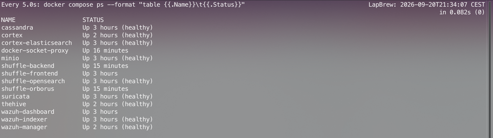

---

### Step 2: Verify Wazuh Cluster Health

```bash
# Check OpenSearch cluster status (should be green)
curl -sk -u admin:SecureWazuh1! \
  https://localhost:9200/_cluster/health?pretty

# Confirm Wazuh manager is connected to the indexer
curl -sk -u wazuh-wui:MyS3cr3tP4ssword! \
  https://localhost:55000/manager/status?pretty
```

Both the OpenSearch cluster health returned green status and the Wazuh manager API confirmed all daemons (`wazuh-modulesd`, `wazuh-monitord`, `wazuh-execd`, `wazuh-analysisd`, `wazuh-remoted`, `wazuh-syscheckd`) operational.

---

### Step 3: Install Wazuh Agent on Ubuntu Target VM

```bash
# On the Ubuntu target VM (10.0.1.10)

# Add Wazuh repository
curl -s https://packages.wazuh.com/key/GPG-KEY-WAZUH | \
  gpg --no-default-keyring --keyring gnupg-ring:/usr/share/keyrings/wazuh.gpg \
  --import && chmod 644 /usr/share/keyrings/wazuh.gpg

echo "deb [signed-by=/usr/share/keyrings/wazuh.gpg] \
  https://packages.wazuh.com/4.x/apt/ stable main" | \
  sudo tee /etc/apt/sources.list.d/wazuh.list

sudo apt update

# Install the agent, pointing it at the Wazuh manager on the host
sudo WAZUH_MANAGER="10.0.1.1" \
     WAZUH_AGENT_NAME="ubuntu-target" \
     apt install -y wazuh-agent

# Start and enable agent
sudo systemctl daemon-reload
sudo systemctl enable --now wazuh-agent

# Confirm agent is running
sudo systemctl status wazuh-agent
```

Wazuh agent service active and running on the target VM:

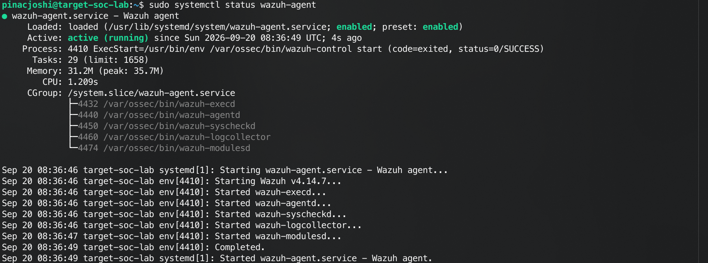

Agent enrolled and appearing as `Active` with telemetry streaming in the Wazuh Dashboard:

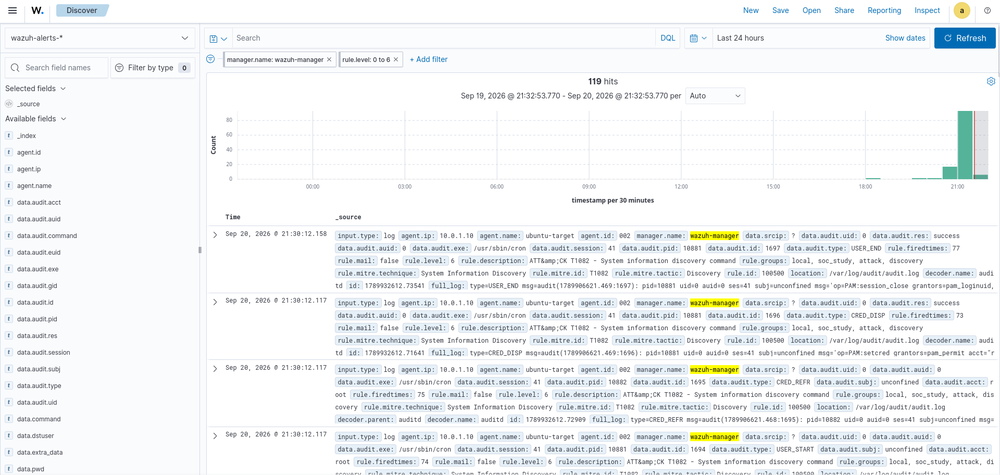

---

### Step 4: Deploy Suricata & Load Emerging Threats Rules

Suricata runs as a Docker container in host-network mode, sniffing traffic on `virbr1` (the target subnet bridge).

```bash
# Pull the Emerging Threats Open ruleset
docker exec suricata suricata-update

# Verify rules loaded
docker exec suricata suricata-update list-sources

# Check EVE JSON log output is being written
docker exec suricata tail -f /var/log/suricata/eve.json | head -20
```

Suricata rule update completed:

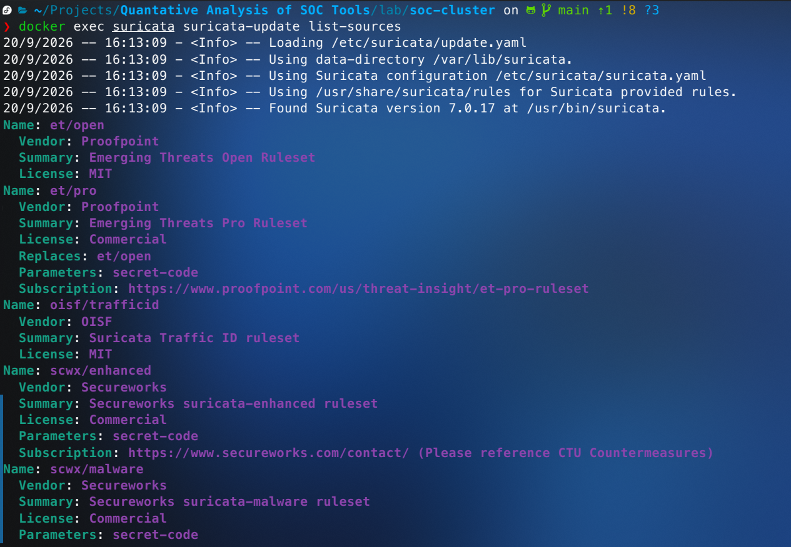

EVE JSON log streaming live events:

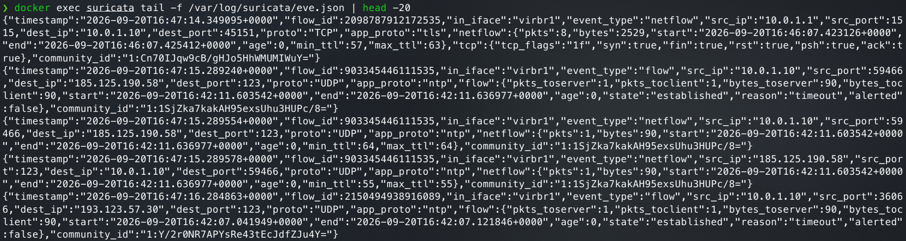

**Verify Suricata is sniffing `virbr1`:**

```bash
# Send a test ping from Kali to Ubuntu to confirm Suricata logs the traffic
ping -c 3 10.0.1.10
```

Ping test executed from Kali Linux attacker VM to Ubuntu target VM:

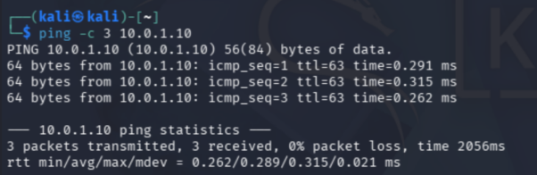

```bash
# On host — look for the ping in Suricata's EVE log
docker exec suricata grep "10.0.1.10" /var/log/suricata/eve.json | tail -5
```

Suricata EVE JSON capturing attacker-to-target ICMP traffic:

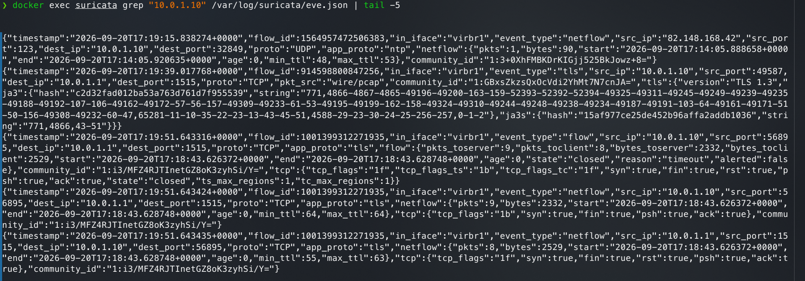

---

### Step 5: Configure TheHive & Cortex — First-Run Setup

**TheHive:**

TheHive status endpoint returning `Ok`:

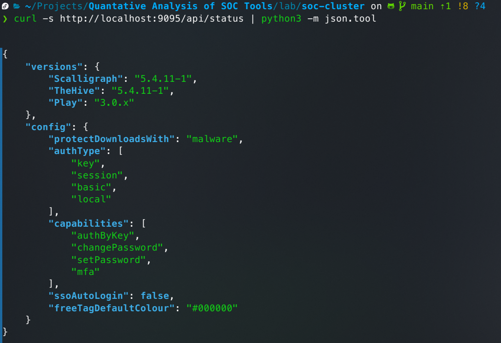

**Cortex:**

Run Elasticsearch database migration:
```bash
docker exec cortex wget -qO- --post-data='' http://localhost:9001/api/maintenance/migrate
```

Initialize Super Administrator account (`admin` / `CortexP@ssw0rd!`):

```bash
docker exec cortex wget -qO- --header="Content-Type: application/json" --post-data='{"login":"admin","name":"Administrator","roles":["superadmin"],"organization":"cortex","password":"CortexP@ssw0rd!"}' http://localhost:9001/api/user
```

Create the operational organization (`thehive`) and integration service account (`thehive-svc`):
```bash
# Renew superadmin API key
SUPERADMIN_KEY=$(docker exec cortex python3 -c '
import urllib.request, urllib.error, json, http.cookiejar

cj = http.cookiejar.CookieJar()
opener = urllib.request.build_opener(urllib.request.HTTPCookieProcessor(cj))

# 1. Access an endpoint to obtain CSRF cookie
try: opener.open("http://localhost:9001/api/user/current")
except urllib.error.HTTPError: pass

csrf = next((c.value for c in cj if "XSRF" in c.name), "")

# 2. Authenticate
login_data = json.dumps({"user": "admin", "password": "CortexP@ssw0rd!"}).encode()
opener.open(urllib.request.Request("http://localhost:9001/api/login", data=login_data, headers={"Content-Type": "application/json", "X-CORTEX-XSRF-TOKEN": csrf}))

# 3. Renew API Key
csrf = next((c.value for c in cj if "XSRF" in c.name), csrf)
req_key = urllib.request.Request("http://localhost:9001/api/user/admin/key/renew", data=b"{}", headers={"Content-Type": "application/json", "X-CORTEX-XSRF-TOKEN": csrf})
print(opener.open(req_key).read().decode().strip())
')

# Create organization "thehive"
curl -s -H "Authorization: Bearer $SUPERADMIN_KEY" -H "Content-Type: application/json" -d '{"name":"thehive","description":"TheHive Integration Organization"}' http://localhost:9091/api/organization

# Create user "thehive-svc" with analyze rights
curl -s -H "Authorization: Bearer $SUPERADMIN_KEY" -H "Content-Type: application/json" -d '{"login":"thehive-svc","name":"TheHive Service Account","roles":["read","analyze","orgadmin"],"organization":"thehive","password":"TheHiveCortexP@ssw0rd!"}' http://localhost:9091/api/user

# Generate API key for thehive-svc
HIVE_KEY=$(curl -s -XPOST -H "Authorization: Bearer $SUPERADMIN_KEY" -H "Content-Type: application/json" http://localhost:9091/api/user/thehive-svc/key/renew)
```

**Link TheHive to Cortex:**

In `lab/soc-cluster/thehive/application.conf` and `lab/soc-cluster/.env`, the Cortex integration is configured with the generated API key:

```hocon
cortex {
  servers: [
    {
      name: "cortex-local"
      url: "http://cortex:9001"
      auth {
        type: "bearer"
        key: "17R5sx2/bR5ju8tr3GsmG6tiYdCz6dfa"
      }
      wsConfig {}
    }
  ]
  refreshDelay: 5 minutes
}
```

After updating the API key and restarting TheHive:

```bash
docker compose restart thehive
```

---

### Step 6: Deploy Shuffle SOAR & Configure Wazuh Webhook

**Shuffle First-Run Setup:**

Access Shuffle UI at http://localhost:3001 and create admin account on first login

**Configure Wazuh → Shuffle webhook:**

In `lab/soc-cluster/wazuh/manager/ossec.conf`, add the integration block:

```xml
<integration>
  <name>shuffle</name>
  <hook_url>http://shuffle-backend:5001/api/v1/hooks/webhook_7f1dcfba-e9e9-4d2b-9926-e1f931fc1f46</hook_url>
  <level>3</level>
  <alert_format>json</alert_format>
</integration>
```

```bash
# Restart Wazuh manager to load the new integration
docker compose restart wazuh-manager

# Confirm integration is registered
docker exec wazuh-manager grep -r "shuffle" /var/ossec/etc/ossec.conf
```

Wazuh integration block confirmed in the running config:

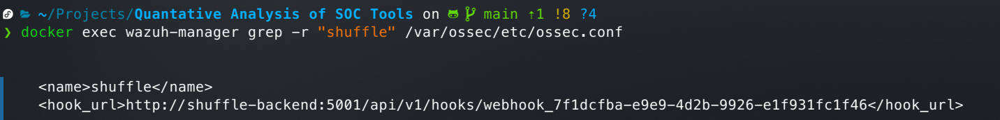

**Configure Shuffle → TheHive case creation workflow:**

In the Shuffle UI, create a workflow triggered by the Wazuh webhook:

1. **Trigger:** Webhook (`Webhook 1`, execution argument `$exec`)
2. **Action:** TheHive (`Create alert`, targeting `http://thehive:9000/api/alert`)

Shuffle workflow configured with Wazuh webhook trigger and TheHive alert action:

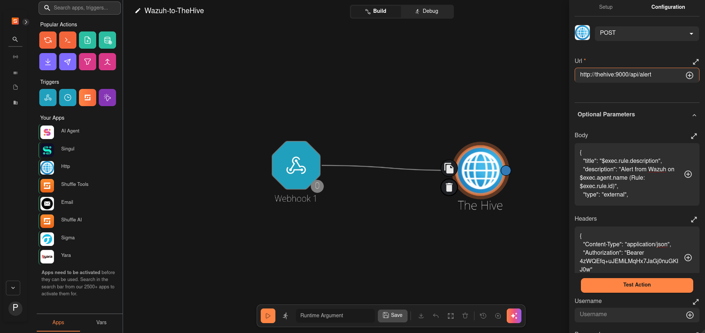

> [!NOTE]
> **SELinux & Docker Socket Handling for Shuffle Orborus:**  
> On Fedora Linux with SELinux enforcing, mounting `/var/run/docker.sock` directly into worker containers causes permission errors when Shuffle Orborus attempts to spawn sub-containers for app execution. To resolve this securely within the internal bridge network, a lightweight `docker-socket-proxy` container (`alpine/socat`) was created at `172.20.0.34`. Orborus is configured with `DOCKER_HOST=tcp://docker-socket-proxy:2375`, allowing seamless container orchestration without host SELinux policies stopping us.

---

### Step 7: End-to-End Verification

Trigger a test alert from the Ubuntu target VM to validate the full pipeline:

```bash
# On Ubuntu target VM — trigger a Wazuh rule (sudo attempt log)
sudo -u nobody id 2>/dev/null || true

# On host — confirm alert appeared in Wazuh
curl -sk -u wazuh-wui:MyS3cr3tP4ssword! \
  "https://localhost:55000/alerts?limit=5&sort=-timestamp&pretty" | \
  python3 -m json.tool | grep "description"
```

The alert was successfully ingested by Wazuh, forwarded via webhook to Shuffle, and automatically ingested into TheHive:

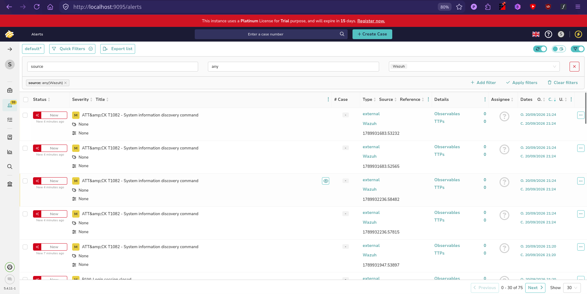

---

## 3. Idle Resource Utilization Baseline

> [!NOTE]
> Resource measurements taken with all four SOC toolsets running, both VMs booted, no active attack traffic. This establishes the idle overhead baseline for comparison against loaded conditions in Weeks 7–9.

```bash
# Docker container CPU and memory usage
docker stats
```

Idle resource utilization across all SOC containers:

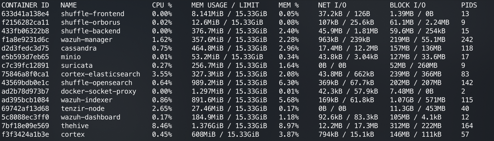

| Container | Idle CPU (%) | Idle RAM | RAM % |
|-----------|-------------|----------|-------|
| shuffle-frontend | 0.00% | 8.1 MiB | 0.05% |
| shuffle-orborus | 0.02% | 12.6 MiB | 0.08% |
| shuffle-backend | 0.00% | 376.7 MiB | 2.40% |
| wazuh-manager | 1.62% | 357.6 MiB | 2.28% |
| cassandra | 0.75% | 464.8 MiB | 2.96% |
| minio | 0.01% | 53.2 MiB | 0.34% |
| suricata | 0.27% | 256.7 MiB | 1.64% |
| cortex-elasticsearch | 3.55% | 327.3 MiB | 2.08% |
| shuffle-opensearch | 0.64% | 989.2 MiB | 6.30% |
| docker-socket-proxy | 0.00% | 1.3 MiB | 0.01% |
| wazuh-indexer | 0.86% | 891.6 MiB | 5.68% |
| wazuh-dashboard | 0.17% | 184.9 MiB | 1.18% |
| thehive | 8.46% | 1.38 GiB | 8.97% |
| cortex | 0.45% | 608.0 MiB | 3.87% |
| **Total Stack** | **~16.8%** | **~5.88 GiB** | **~37.8%** |

```bash
# Host system overall resource utilization via top
top
```

Host machine resource state under full idle lab workload:

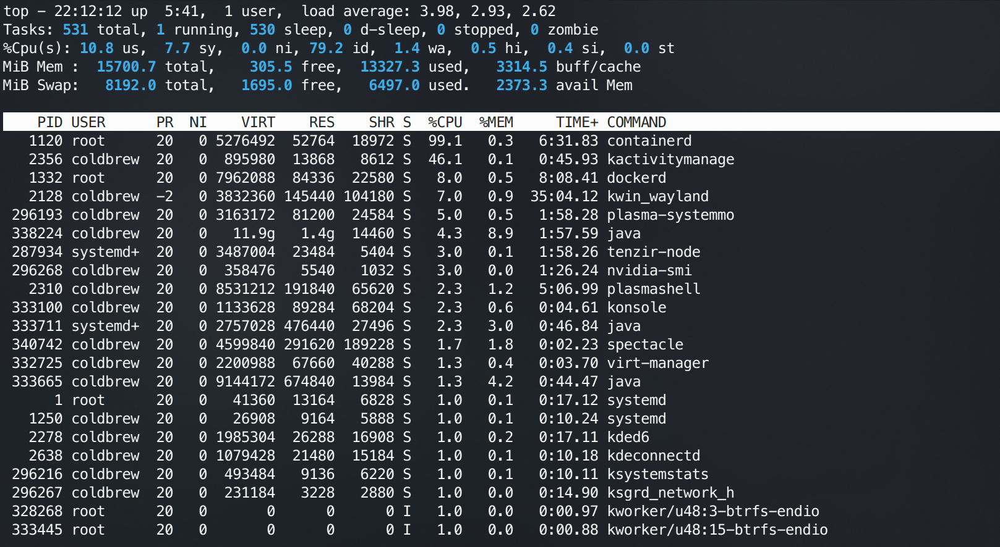

> [!Note]
> Measured values establish the Week 3 baseline row in the resource comparison chart built in Week 11. Even with all 14 SOC containers active, indexing services running, and both QEMU VMs active in the background, the host retains ~2.37 GiB available memory and ~79.2% CPU idle headroom. I will have to add more swap later maybe.

---

## 4. Service URL & Credential Reference

| Service | URL | Credentials |
|---------|-----|-------------|
| Wazuh Dashboard | https://localhost:5601 | `admin` / `SecureWazuh1!` |
| Wazuh REST API | https://localhost:55000 | `wazuh-wui` / `MyS3cr3tP4ssword!` |
| Wazuh Indexer | https://localhost:9200 | `admin` / `SecureWazuh1!` |
| TheHive | http://localhost:9095 | `admin@thehive.local` / `secret` |
| Cortex | http://localhost:9091 | `admin` / `CortexP@ssw0rd!` |
| Shuffle | http://localhost:3001 | Set on first run |
| MinIO Console | http://localhost:9001 | `thehive` / `MinioP@ssw0rd!` |
| Docker Socket Proxy | `tcp://docker-socket-proxy:2375` (internal) | Internal TCP bridge for Orborus |

---

## 5. Current File & Directory Structure

```
.
├── CREDENTIALS.txt
├── images
│   ├── week2
│   │   ├── ...
│   └── week3
│       ├── ...
├── lab
│   ├── soc-cluster
│   │   ├── cortex
│   │   │   └── application.conf
│   │   ├── docker-compose.yml
│   │   ├── suricata
│   │   │   ├── logs
│   │   │   │   ├── eve.json
│   │   │   │   ├── fast.log
│   │   │   │   ├── stats.log
│   │   │   │   └── suricata.log
│   │   │   ├── rules
│   │   │   │   ├── classification.config
│   │   │   │   └── suricata.rules
│   │   │   └── suricata.yaml
│   │   ├── thehive
│   │   │   └── application.conf
│   │   └── wazuh
│   │       ├── certs
│   │       │   ├── admin-key.pem
│   │       │   ├── admin.pem
│   │       │   ├── esnode-key.pem
│   │       │   ├── esnode.pem
│   │       │   ├── generate-certs.sh
│   │       │   ├── root-ca.pem
│   │       │   ├── wazuh-dashboard-key.pem
│   │       │   ├── wazuh-dashboard.pem
│   │       │   ├── wazuh-manager-key.pem
│   │       │   └── wazuh-manager.pem
│   │       ├── dashboard
│   │       │   └── opensearch_dashboards.yml
│   │       ├── indexer
│   │       │   ├── internal_users.yml
│   │       │   └── wazuh.indexer.yml
│   │       └── manager
│   │           ├── local_rules.xml
│   │           └── ossec.conf
│   ├── vm-networks
│   │   ├── attacker-net.xml
│   │   └── target-net.xml
│   └── vms
│       ├── disks
│       └── isos
│           ├── kali-attacker-mem.week 2 initial setup
│           ├── kali-linux-2026.2-qemu-amd64.7z
│           ├── kali-linux-2026.2-qemu-amd64.qcow2
│           ├── kali-linux-2026.2-qemu-amd64.week 2 initial setup
│           └── ubuntu-24.04-server.iso
├── Quantitative_Analysis_of_SOC_Toolsets_Course_Proposal.docx
├── README.md
├── week1.md
├── week2.md
└── week3.md

20 directories, 64 files
```

---
